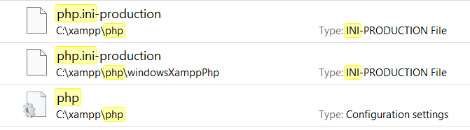

<h1>Modern Fit Gym Documentation</h1>

<h2>Table of Contents</h2>

- [Problem Statement](#problem-statement)
- [Project-Vision](#project-vision)
- [Project Objectives](#project-objectives)
- [Tech Stack](#tech-stack)
- [Git Commands](##git-commands-for-making-changes-and-pushing-them-to-your-forked-repo)
- [Setup Developer Environment](#tech-stack)


<hr />

### Problem statement 
Using a paper-based system to manage a gym would result in problems such as inaccurate data, difficulty with membership such as membership paying, communication breakdowns and security vulnerabilities. Memberships would be hard to keep track of as trying to track a member’s history with the gym as well as their payment plan could easily get lost or destroyed as it is on paper. False data could easily be added in which would result in a breach of data and a security risk; with no way of knowing where this breach came from. Miscommunication between a trainer and member would lead to a problem with the payment plan, resulting in either overpaying or underpaying on the member’s side.

### Project Vision
The vision for this project is to transform and digitalise ModerFit Gym’s overall efficiency in obtaining further increase in membership and improving existing customers’ experience.

### Project Objectives
<ul>
<li>There will be separate roles for staff and members within the ModernFit Gym website.    </li>
<li>A signup feature will be implemented that allows the user to create an account.     </li>
<li>Login feature will allow users to login to the Modern Fit Gym website and access all features available for logged in members.  </li>
<li>Logged in users will be able to view nutrition information about differing foods such as check their regimes.   </li>
<li>Logged in users will be able to document their daily food/physical activities on an intuitive user interface.   </li>
<li>The trainers will be able to view and make their assigned members’ nutritional and physical regimes to monitor their progress.  </li>
<li>There will be an easy to use and accessible graphical user interface provided 24/7.     </li>
<li>Downtime for maintenance will be communicated in advance to the users. </li>
<li>Every user will have a unique pin to access the gym and the website.    </li>
</ul>

### Tech Stack
Laravel | PHP | JavaScript | SQLite

### Git Commands:

`git init`

<br />

`git add .`

<br />

`git commit -m "enter your commit message"`

<br />

`git push` (push data)

<br />

`git pull` (pull data)

<br />

`git branch` (check number of branches)


### Setup Developer Environment

#### Installation

- Before running the application please make sure you have composer installed https://getcomposer.org.
- Also make sure to install XAMPP https://www.apachefriends.org/download.html
- Installing DB Browser will help you visualize the SQL data https://sqlitebrowser.org

#### .env
Create a `.env` file in the root directory and make sure to change the `DB_DATABASE` connection path to where you have the `ModernFitGymDatabase` file located on your local system. Add the following to your `.env`:
```
APP_NAME=Laravel
APP_ENV=local
APP_KEY=base64:EXrdR65+0qMIFae/fgliWD9hOTQc30vFS4eTyOvwjQw=
APP_DEBUG=true
APP_URL=http://localhost

LOG_CHANNEL=stack
LOG_DEPRECATIONS_CHANNEL=null
LOG_LEVEL=debug

DB_CONNECTION=sqlite
DB_DATABASE="C:/Users/noora/OneDrive/Desktop/PROGRAMMING/TEST-LARAVEL/Modern-Fit-Gym/database/ModernFitGymDatabase.db"
DB_PORT=3306
DB_DATABASE="C:/Users/noora/OneDrive/Desktop/PROGRAMMING/TEST-LARAVEL/Modern-Fit-Gym/database/ModernFitGymDatabase.db"
DB_USERNAME=root
DB_PASSWORD=

BROADCAST_DRIVER=log
CACHE_DRIVER=file
FILESYSTEM_DISK=local
QUEUE_CONNECTION=sync
SESSION_DRIVER=file
SESSION_LIFETIME=120

MEMCACHED_HOST=127.0.0.1

REDIS_HOST=127.0.0.1
REDIS_PASSWORD=null
REDIS_PORT=6379

MAIL_MAILER=smtp
MAIL_HOST=mailpit
MAIL_PORT=1025
MAIL_USERNAME=null
MAIL_PASSWORD=null
MAIL_ENCRYPTION=null
MAIL_FROM_ADDRESS="hello@example.com"
MAIL_FROM_NAME="${APP_NAME}"

AWS_ACCESS_KEY_ID=
AWS_SECRET_ACCESS_KEY=
AWS_DEFAULT_REGION=us-east-1
AWS_BUCKET=
AWS_USE_PATH_STYLE_ENDPOINT=false

PUSHER_APP_ID=
PUSHER_APP_KEY=
PUSHER_APP_SECRET=
PUSHER_HOST=
PUSHER_PORT=443
PUSHER_SCHEME=https
PUSHER_APP_CLUSTER=mt1

VITE_APP_NAME="${APP_NAME}"
VITE_PUSHER_APP_KEY="${PUSHER_APP_KEY}"
VITE_PUSHER_HOST="${PUSHER_HOST}"
VITE_PUSHER_PORT="${PUSHER_PORT}"
VITE_PUSHER_SCHEME="${PUSHER_SCHEME}"
VITE_PUSHER_APP_CLUSTER="${PUSHER_APP_CLUSTER}"
```

#### Troubleshooting
A common error that some of our team mates had was installation problems. Once you have done that go into your XAMPP folder and find the php and php.ini-production files, open them and remove the `;` from `;extension=zip`. This may not be necesarry to do but in the beginning we faced errors regarding installation like this one which is why I have mentioned it.

<br />



#### Run Application

Firstly, to make sure everything is correctly installed please run `composer install` in the vscode terminal.

Once that is completed and there aren't any concerns start you're application by running `php artisan serve` in the terminal.